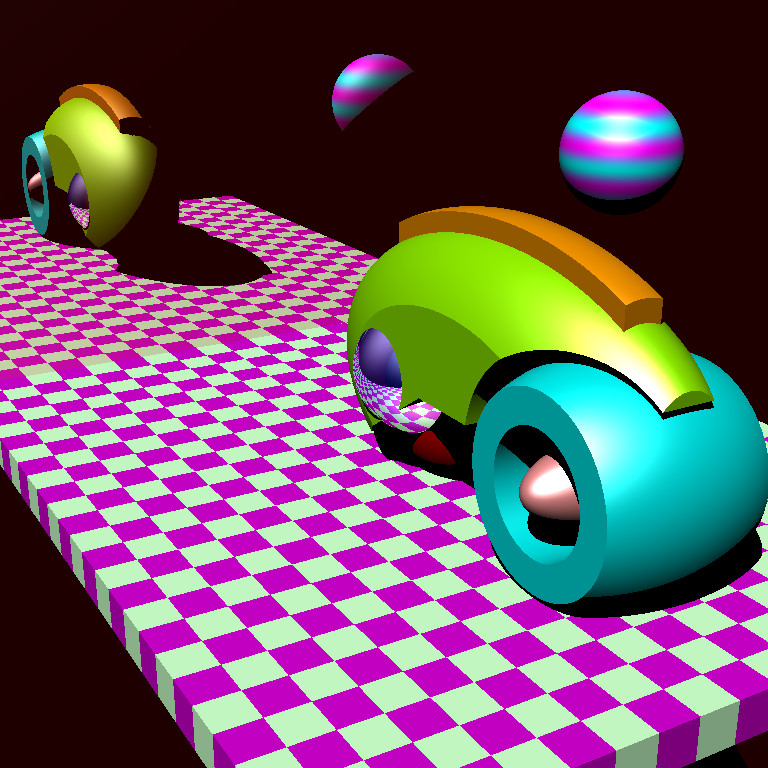

# min-caml-dev-image

min-caml 動作確認用の環境を提供する Docker イメージ。

* min-caml
  * https://github.com/esumii/min-caml

## 使い方

### Docker イメージのビルド

```sh
$ docker build -t min-caml-dev .
```

### min-caml のビルド

min-caml のソースファイルを取得し、コンテナを起動。

```sh
$ cd ~/src
$ git clone https://github.com/esumii/min-caml.git
$ cd min-caml
$ docker run -it --rm -v `pwd`:/app min-caml-dev bash
```

コンテナ内で min-caml をビルド。

```sh
$ ./to_x86
$ make min-caml
$ ./min-caml --help
Mitou Min-Caml Compiler (C) Eijiro Sumii
usage: ./min-caml [-inline m] [-iter n] ...filenames without ".ml"...
  -inline maximum size of functions inlined
  -iter maximum number of optimizations iterated
  -help  Display this list of options
  --help  Display this list of options
```

### テストプログラムのコンパイル

ビルドした min-caml を使って test/fib.ml をコンパイルして実行、test/fib.ml の結果が表示されれば成功。

```sh
$ make test/fib
$ ./test/fib
sp = 0x3ff0b560, hp = 0x3f157010
832040
```

### レイトレーサーのビルドと実行

レイトレーサー `min-rt` をビルドして実行。

```
$ cd min-rt
$ make contest.mincaml.ppm
```

レイトレーシング結果の画像ファイル `contest.mincaml.ppm` が生成される。


